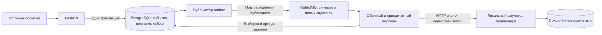

# NotifyBridge

Платформа уведомлений на Python: одно событие создаёт доставки по выбранным каналам,
учитывает настройки получателя и тихие часы, а обычные сообщения может объединять
в дайджест. Транзакционные уведомления обрабатываются с повышенным приоритетом.

**Стек:** Python 3.12+, FastAPI, PostgreSQL 17, SQLAlchemy, Alembic, RabbitMQ 4.1,
HTTPX, Jinja2, Docker Compose.

Email, push и webhook представлены **локальным HTTP-эмулятором**. Он сохраняет
результаты и воспроизводит сбои, но не отправляет настоящие сообщения. Для подключения
внешнего провайдера нужен адаптер с явно определёнными гарантиями идемпотентности.

## Быстрый запуск

Требуются Docker с Compose и Python 3. Для проверки стиля и сценария восстановления
также нужен `uv`.

```bash
make up          # Создаёт .env, применяет миграции и запускает сервисы.
make smoke       # Проверяет три канала, повторы событий и дайджест.
make check       # Проверяет зависимости, стиль и форматирование.
make test        # Запускает тесты с отдельными PostgreSQL и RabbitMQ.
make recovery    # Воспроизводит сбои и проверяет восстановление.
make down        # Останавливает сервисы, сохраняя данные.
```

Swagger API: <http://localhost:8250/docs>.
Эмулятор провайдера: <http://localhost:8251/docs>.
Оба порта доступны только с локального компьютера; PostgreSQL и RabbitMQ не
публикуют порты на хосте. Токен администратора хранится в `.env`, который исключён
из Git. `make init` создаёт новый токен только при отсутствии этого файла.

`make recovery` запускается после `make up` и `make check`. Сценарий временно меняет
режим эмулятора, аварийно останавливает обычный воркер и выключает RabbitMQ этого
проекта. Затем он восстанавливает сервисы. Не запускайте его параллельно с ручным демо.

## Возможности

- Три канала: email, push, webhook; отдельные настройки для каждого канала.
- Часовые пояса IANA, тихие часы через полночь, переходы на летнее и зимнее время.
- Немедленная доставка или дайджест с фиксированным временным окном.
- Приоритетные транзакционные сообщения и выделенный для них воркер.
- Дедупликация входящих событий и стабильный ключ каждой доставки.
- Транзакционный outbox, подтверждения RabbitMQ и резервный опрос PostgreSQL.
- Конкурентные воркеры с арендой задания и защитой от устаревших результатов.
- Повторы с увеличением задержки, журнал попыток и ручной перезапуск неудачных доставок.
- Неизменяемое содержимое сообщения после первой попытки отправки.
- HTML-шаблон Jinja2 с экранированием пользовательского текста.
- API статусов, метрики Prometheus, проверки готовности и работоспособности.

## Архитектура



Источником заданий служит PostgreSQL. Сообщение RabbitMQ только будит воркер:
потеря или повтор такого сигнала не создаёт новую доставку. Даже без брокера воркеры
периодически проверяют таблицу заданий. По умолчанию интервал опроса — 0,5 секунды.

Публикатор помечает запись outbox только после подтверждения RabbitMQ. Если он
упадёт между публикацией и фиксацией транзакции, сигнал будет опубликован повторно.
Это допустимо: воркеры выбирают существующие задания через `FOR UPDATE SKIP LOCKED`.

Сетевой запрос к провайдеру выполняется **вне транзакции PostgreSQL**. В таблице
сохраняются срок аренды и случайный токен. Записать результат может только владелец
действующей аренды. После истечения срока другой воркер повторяет отправку с тем же
ключом идемпотентности и тем же содержимым.

В локальном стенде эмулятор использует отдельные таблицы в той же БД. Это удобство
демонстрации, а не распределённая транзакция: принятие сообщения провайдером и
фиксация результата воркером происходят независимо.

## Правила доставки

### События и повторы

Клиент задаёт UUID `event_id`. Первый запрос возвращает `202`; повтор с тем же
содержимым — `200` и исходные идентификаторы доставок. Если содержимое изменилось,
возвращается `409`. Порядок перечисления каналов не меняет смысл события.

Событие, доставки и запись outbox сохраняются одной транзакцией. Блокировка
получателя согласует конкурентные события, обновления настроек и сборку дайджеста.
Ключ провайдера — UUID доставки. Новый входящий дубль не меняет этот ключ.

### Предпочтения и тихие часы

Для каждого канала задаются адрес, флаг `enabled` и режим `immediate` либо `digest`.
Отсутствующий или отключённый канал не создаёт доставку; он перечисляется в поле
`suppressed`. Если отключены все выбранные каналы, событие сохраняется без заданий.

Тихие часы задаются парой `HH:MM` и часовым поясом. Начальная граница включена,
конечная — нет. Равные границы запрещены; отсутствие обеих границ отключает правило.
Поиск ближайшего разрешённого времени идёт по UTC и корректно проходит пропущенные
и повторяющиеся местные часы при смене DST.

Настройки сохраняются вместе с доставкой. Изменение получателя влияет на **новые
события**; уже созданные доставки сохраняют прежний адрес и правила. Перед каждой
попыткой обычного сообщения воркер ещё раз проверяет тихие часы по этому снимку,
поэтому накопившаяся очередь не отправляется посреди тихого периода.

### Приоритет

`priority: "transactional"` отменяет тихие часы и режим дайджеста, но **не включает
отключённые каналы**. Приоритет разрешено указывать только авторизованному источнику.
Обычный воркер сначала выбирает транзакционные задания; второй воркер обслуживает
только их, чтобы обычные сообщения не заняли все доступные исполнители.

Это приоритет обработки, а не гарантированное время доставки: задержка зависит от
доступности БД, провайдера, объёма очереди и количества воркеров. При непрерывной
высокой транзакционной нагрузке обычные сообщения могут ждать дольше.

### Дайджест

Окна фиксированы относительно Unix time, а не отсчитываются от последнего события.
Время отправки — конец окна, сдвинутый до разрешённого времени, если действуют тихие
часы. Разные окна не объединяются, даже если оба откладываются до утра.

Группа определяется получателем, версией его настроек, каналом и окном. Один дайджест
содержит не более 100 событий; последующие события создают дополнительную группу.
При первой попытке воркер закрывает группу и сохраняет готовое сообщение. Новые
события уже не могут менять его содержимое. Повторы отправляют сохранённую версию
шаблона, поэтому изменение кода между попытками не меняет запрос провайдера.

## Сбои и гарантии

| Ситуация | Поведение |
|---|---|
| Повтор входящего события | Возвращаются исходные доставки |
| Повтор сигнала RabbitMQ | Новая доставка не создаётся |
| RabbitMQ недоступен | События остаются в БД; воркеры работают через опрос |
| Провайдер вернул 503 или 429 | Повтор с увеличенной задержкой |
| Провайдер вернул постоянную ошибку 4xx | Статус `dead`, кроме 408, 425 и 429 |
| Провайдер принял сообщение, но ответ потерян | Повтор с тем же ключом и содержимым |
| Воркер упал после принятия сообщения | Повтор после истечения аренды |
| Вернулся старый воркер | Его просроченный токен не позволяет изменить состояние |
| Число попыток исчерпано | Статус `dead`, доступен ручной перезапуск |

По умолчанию разрешено 5 попыток. Задержка растёт экспоненциально до 300 секунд,
добавляется небольшой разброс. Общий таймаут обращения к провайдеру — 3 секунды,
аренда — 15 секунд. Таймаут должен быть короче аренды. Ошибки соединения и
некорректные ответы считаются временными. Перенаправления HTTP не выполняются.

Локальный провайдер хранит ключи идемпотентности без срока истечения. Для одного
ключа он создаёт только одну запись; запрос с другим содержимым отклоняет с `409`.
Именно этот контракт позволяет избежать второго внешнего эффекта после потери
ответа. **Для внешнего провайдера без такой поддержки отсутствие дублей не
гарантируется.** Статус `sent` означает подтверждённое принятие провайдером, а не
прочтение сообщения пользователем.

Ручной перезапуск разрешён только для `dead`: он сбрасывает счётчик текущей серии
попыток, но сохраняет ключ и содержимое. История прежних попыток остаётся в БД.
Записи с `lease_expired` означают потерянную аренду; они не доказывают, что провайдер
не принял сообщение.

## HTTP API

Все рабочие и административные запросы требуют
`Authorization: Bearer <ADMIN_TOKEN из .env>`. Проверки `/health/*` открыты.

| Метод / путь | Назначение |
|---|---|
| `POST /v1/recipients` | Создать получателя |
| `PUT /v1/recipients/{id}` | Полностью заменить настройки и увеличить их версию |
| `POST /v1/events` | Принять событие или вернуть результат его предыдущего приёма |
| `GET /v1/events/{id}` | Посмотреть состояния доставок |
| `GET /v1/deliveries?status=dead` | Получить первые 100 доставок выбранного состояния |
| `GET /v1/deliveries/{id}/attempts` | Посмотреть первые 100 записей истории попыток |
| `POST /v1/deliveries/{id}/retry` | Повторно запустить неудачную доставку |
| `GET /metrics` | Количество доставок по состояниям и размер outbox |
| `GET /health/live` | Проверить работу API |
| `GET /health/ready` | Проверить доступность PostgreSQL |

Пример получателя:

```json
{
  "name": "Иван",
  "timezone": "Europe/Moscow",
  "quiet_start": "22:00",
  "quiet_end": "08:00",
  "channels": {
    "email": {
      "destination": "ivan@example.test",
      "enabled": true,
      "mode": "digest",
      "digest_seconds": 300
    },
    "push": {"destination": "demo-device", "mode": "immediate"}
  }
}
```

Пример события, где UUID получателя берётся из предыдущего ответа:

```json
{
  "event_id": "60752386-d30e-4cce-a906-f40527fd60b6",
  "recipient_id": "a73295c0-6143-4cde-90bd-6c61c02758ac",
  "subject": "Заказ передан в доставку",
  "body": "Курьер свяжется с вами перед приездом.",
  "priority": "transactional",
  "channels": ["email", "push"]
}
```

Эмулятор на порту `8251` принимает `PUT /admin/modes/{channel}` с одним из режимов:
`healthy`, `unavailable`, `accept_then_timeout`, `reject`. Режим `accept_then_timeout`
сначала сохраняет результат, а затем задерживает первый ответ дольше таймаута воркера.
Повтор того же ключа возвращает сохранённый результат сразу. Записи видны через
`GET /admin/receipts`; эти методы также требуют токен.

## Настройки

| Переменная | Значение по умолчанию / назначение |
|---|---|
| `DATABASE_URL` | Строка подключения к PostgreSQL |
| `RABBITMQ_URL` | Строка подключения к RabbitMQ |
| `ADMIN_TOKEN` | Обязательный секрет, не менее 24 символов |
| `PROVIDER_URL` | Фиксированный HTTP(S)-адрес провайдера без пути |
| `PROVIDER_TIMEOUT` | 3 секунды на весь запрос |
| `LEASE_SECONDS` | 15 секунд |
| `POLL_SECONDS` | 0,5 секунды |
| `RETRY_BASE` | 1 секунда |
| `MAX_ATTEMPTS` | 5 попыток |
| `WORKER_LANE` | `all` или `transactional` |

Адрес получателя в этом стенде — данные эмулятора, а не URL для исходящего запроса.
Клиент не может заставить шлюз обратиться к произвольному хосту. HTML экранируется;
клиент не передаёт исполняемый шаблон Jinja2.

## Проверки и ограничения

[VERIFICATION.md](VERIFICATION.md) содержит результаты локального запуска.
CI проверяет стиль, тесты, запуск контейнеров, доставку и восстановление.
В тестах используются настоящие PostgreSQL и RabbitMQ; smoke и recovery работают
с отдельными HTTP-процессами.

Проверка готовности API зависит от PostgreSQL, а не от RabbitMQ: отказ брокера
покрывается резервным опросом. Проверки воркеров следят за обновлением отметки их
основного цикла; это не подтверждение успешной доставки. Ошибки и очередь нужно
контролировать отдельно по статусам, журналу попыток и метрикам.

В проект не входят реальные SMTP/FCM/APNs-адаптеры, подтверждения прочтения,
многопользовательская авторизация, хранение секретов во внешнем сервисе, TLS,
отказоустойчивый кластер БД и автоматическая очистка истории. Один токен имеет
полный доступ к получателям и содержимому сообщений. Для публичного сервиса
нужны отдельные права, правила хранения персональных данных и защита входного API.

Справочные материалы: [подтверждения RabbitMQ](https://www.rabbitmq.com/docs/confirms),
[повторы при сбоях](https://www.rabbitmq.com/docs/reliability),
[SKIP LOCKED в PostgreSQL](https://www.postgresql.org/docs/14/sql-select.html).
